# 🧠 AI-Based Career Advisor — System Architecture

> **Top 0.1% Architecture Documentation**  
> A full-stack, AI-powered career advisory platform with semantic job matching, LLM-driven mentoring, skill-gap analysis, adaptive testing, and personalized roadmap generation.

---

## 1. 🗺️ High-Level System Overview

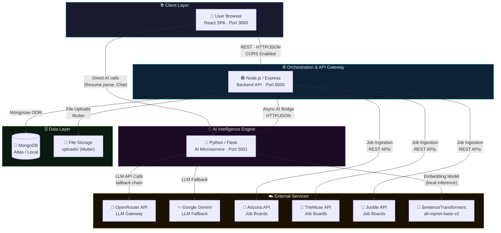

---

## 2. 🎨 Frontend Architecture (React SPA)

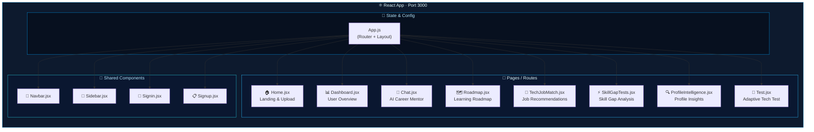

### Frontend → Backend API Mapping

| Page | Backend Endpoint | Method |
|---|---|---|
| `Home.jsx` | `/api/resume/upload` | `POST` |
| `Dashboard.jsx` | `/api/user/profile`, `/api/jobs` | `GET` |
| `TechJobMatch.jsx` | `/api/jobs`, AI `/api/recommend` | `GET/POST` |
| `SkillGapTests.jsx` | AI `/api/skill-gaps` | `POST` |
| `Roadmap.jsx` | `/api/roadmap/*`, AI `/generate-roadmap` | `GET/POST` |
| `Test.jsx` | `/api/test/*`, AI `/generate-test` | `GET/POST` |
| `Chat.jsx` | `/api/chat/*`, AI `/api/chat` | `POST` |
| `ProfileIntelligence.jsx` | AI `/api/classify`, `/api/career-paths` | `POST` |

---

## 3. 🟢 Backend Architecture (Node.js / Express)

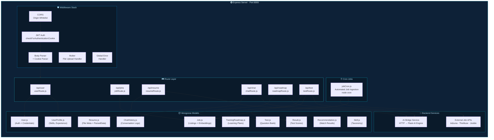

---

## 4. 🤖 AI Engine Architecture (Python / Flask)

```mermaid
graph TD
    subgraph AI["🐍 Flask AI Microservice  ·  Port 5001"]
        direction TB

        subgraph API_ENDPOINTS["🌐 REST Endpoints"]
            EP1["GET  /health"]
            EP2["POST /parse-resume"]
            EP3["POST /recommend (legacy)"]
            EP4["POST /api/recommend"]
            EP5["POST /api/classify"]
            EP6["POST /api/skill-gaps"]
            EP7["POST /api/career-paths"]
            EP8["POST /chat"]
            EP9["POST /api/chat"]
            EP10["POST /generate-roadmap"]
            EP11["POST /generate-test"]
            EP12["POST /api/readiness-score"]
            EP13["POST /api/classify-stage"]
            EP14["GET  /api/status"]
        end

        subgraph SERVICES["🧠 AI Service Layer (Lazy-Loaded)"]
            EMBED["EmbeddingService\nall-mpnet-base-v2\n768-dim vectors"]
            LLM["LLMService\nOpenRouter + Gemini\nFallback Chain"]
            CLASSIFY["ClassifierService\nZero-shot Category\nClassification"]
            RECOMM["RecommenderEngine\nCosine Similarity +\nWeighted Scoring"]
            SKILL_GAP["SkillGapAnalyzer\nGap Detection +\nLearning Roadmap"]
            CAREER["CareerPathAnalyzer\nPath Progression\nSuggestions"]
            RESUME["ResumeParser\nPDF + DOCX\nNLP Extraction"]
            ROAD_GEN["RoadmapGenerator\nPersonalized\nLearning Plans"]
            TEST_GEN["TestGenerator\nAdaptive MCQ\nGeneration"]
            READY["ReadinessCalculator\nCRI Score (0-100)"]
            EXPLAIN["ExplainabilityService\nMatch Reasoning\n+ Insights"]
            SIMIL["SimilarityEngine\nCosine + Jaccard\nHybrid Scoring"]
        end

        subgraph MODELS_ML["🏗️ ML Model Artifacts"]
            MPNET_MODEL["SentenceTransformer\nall-mpnet-base-v2\n(local weights)"]
            SKILL_TAXONOMY["Skill Taxonomy\nCategory Mapping\nJSON Knowledge Base"]
        end

        subgraph INIT["⚙️ Lifecycle"]
            LAZY_INIT["Lazy Initialization\non first request\n< 1s cold start"]
            GLOBAL_STATE["Global Service\nRegistry\n(singleton pattern)"]
        end
    end

    EP2 --> RESUME
    EP2 --> EMBED
    EP3 --> RECOMM
    EP4 --> RECOMM
    EP4 --> SKILL_GAP
    EP4 --> CAREER
    EP5 --> CLASSIFY
    EP6 --> SKILL_GAP
    EP7 --> CAREER
    EP7 --> CLASSIFY
    EP8 --> LLM
    EP9 --> LLM
    EP10 --> ROAD_GEN
    EP11 --> TEST_GEN
    EP12 --> READY
    EP13 --> CLASSIFY

    RECOMM --> EMBED
    RECOMM --> CLASSIFY
    RECOMM --> SIMIL
    RECOMM --> EXPLAIN
    RECOMM --> SKILL_GAP
    RECOMM --> CAREER
    CLASSIFY --> EMBED
    EMBED --> MPNET_MODEL
    CLASSIFY --> SKILL_TAXONOMY

    LAZY_INIT --> EMBED
    LAZY_INIT --> LLM
    LAZY_INIT --> CLASSIFY
    LAZY_INIT --> RECOMM
    LAZY_INIT --> GLOBAL_STATE

    style AI fill:#1b0a24,stroke:#ce93d8,color:#f3e5f5
    style API_ENDPOINTS fill:#180820,stroke:#ab47bc,color:#e1bee7
    style SERVICES fill:#180820,stroke:#9c27b0,color:#e1bee7
    style MODELS_ML fill:#180820,stroke:#7b1fa2,color:#ce93d8
    style INIT fill:#0f0515,stroke:#6a1b9a,color:#ce93d8
```

---

## 5. 🔄 Core Data Flow — Job Recommendation Pipeline

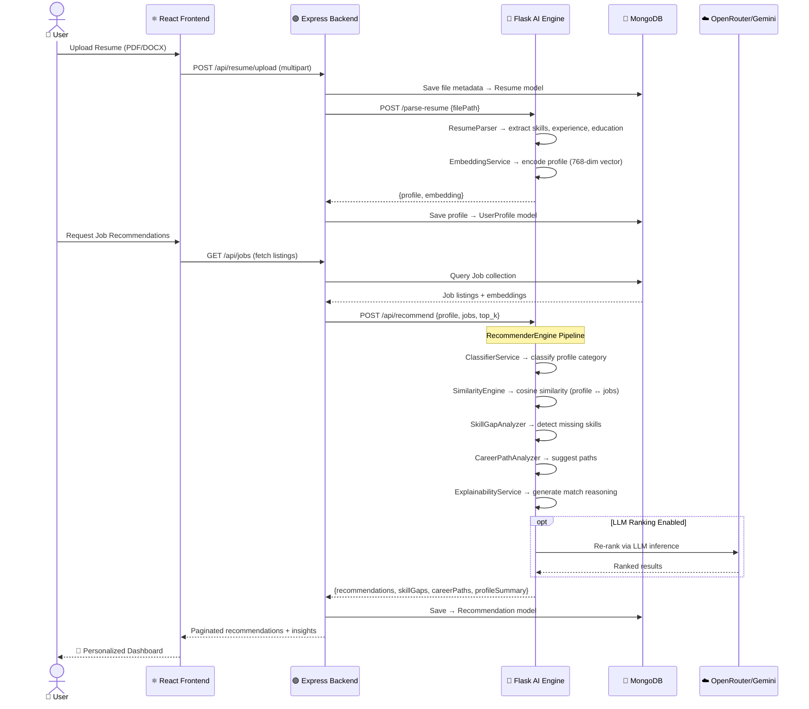

---

## 6. 💬 AI Chat / Mentor Flow

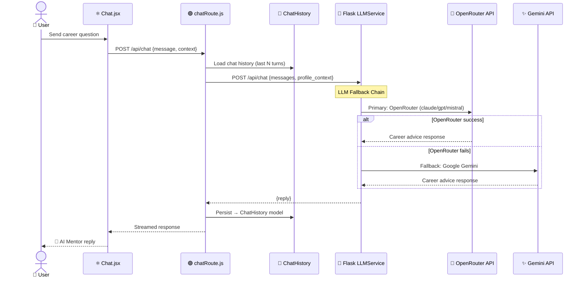

---

## 7. ⏰ Automated Job Ingestion Flow

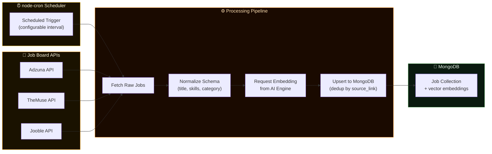

---

## 8. 🧬 AI Services Dependency Graph

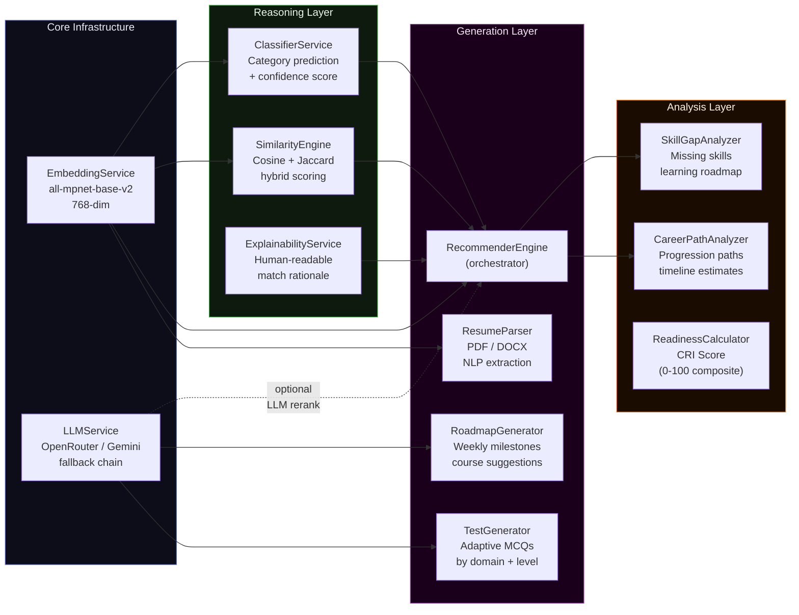

---

## 9. 🗄️ Database Schema (MongoDB Collections)

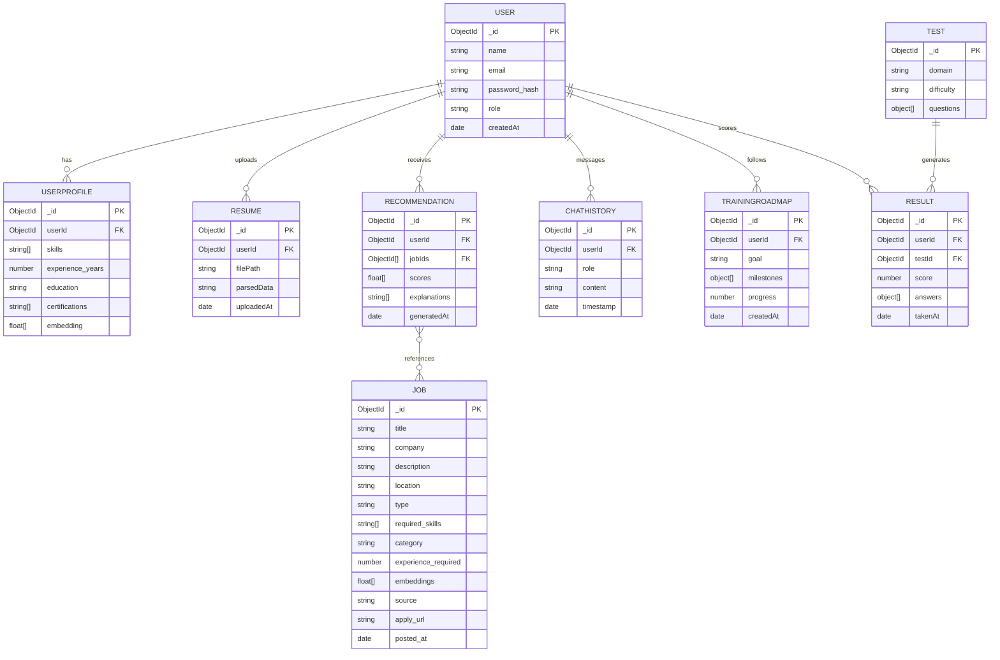

---

## 10. 🔐 Security & Auth Architecture

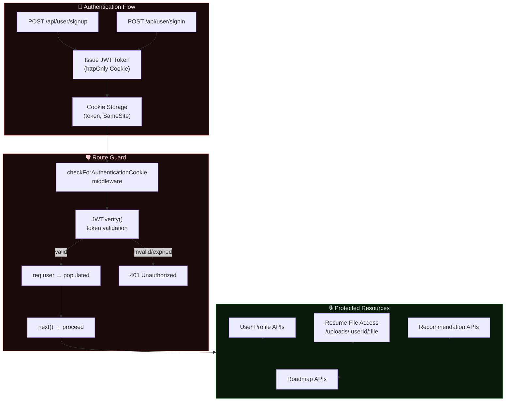

---

## 11. 🏗️ Deployment & Infrastructure View

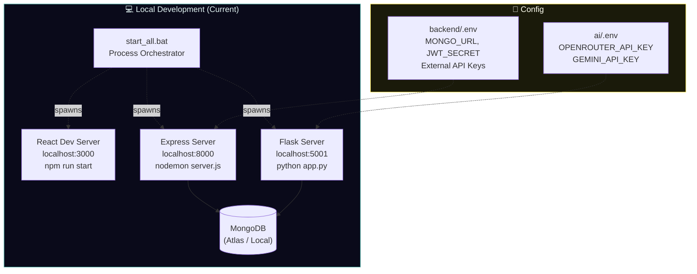

---

## 12. 📊 Technology Stack Summary

| Layer | Technology | Version / Details |
|---|---|---|
| **Frontend** | React.js | SPA · JSX · CSS Modules |
| **Routing** | React Router | Client-side routing |
| **Backend** | Node.js + Express | v5.x · REST API |
| **Authentication** | JWT + Cookie | `jsonwebtoken` · `cookie-parser` |
| **File Uploads** | Multer | Disk storage · PDF/DOCX |
| **Database** | MongoDB + Mongoose | v8.x ODM |
| **Scheduled Jobs** | node-cron | Job board ingestion |
| **AI Framework** | Python + Flask | v3.0 · CORS enabled |
| **Embeddings** | SentenceTransformers | `all-mpnet-base-v2` · 768-dim |
| **ML** | scikit-learn + PyTorch | Cosine similarity · classification |
| **LLM Gateway** | OpenRouter API | claude, gpt, mistral (routing) |
| **LLM Fallback** | Google Gemini API | `google-generativeai` |
| **Document Parsing** | PyPDF2 + python-docx | PDF + DOCX resume parsing |
| **Node.js LLM** | OpenAI SDK + Gemini SDK | Backend-side LLM calls |
| **External Jobs** | Adzuna · TheMuse · Jooble | REST job aggregators |
| **DevOps** | `.bat` orchestrator | `start_all.bat` multi-process |

---

## 13. 🧩 Key Architectural Patterns

> [!NOTE]
> **Lazy Service Initialization** — The Flask AI Engine uses a singleton lazy-load pattern. All heavy ML models (SentenceTransformers, classifiers) are loaded only on the first request, keeping cold-start time under 1 second.

> [!TIP]
> **LLM Fallback Chain** — The `LLMService` implements a waterfall fallback: OpenRouter (primary, multiple models) → Google Gemini (secondary). This guarantees near-100% availability for chat and generation features.

> [!IMPORTANT]
> **Decoupled AI Bridge** — The Node.js backend does NOT contain any ML logic. All intelligence is delegated to the Flask microservice via HTTP. This allows the AI engine to be independently scaled, swapped, or updated without touching the core backend.

> [!NOTE]
> **Vector-First Job Matching** — Jobs in MongoDB store pre-computed 768-dim embeddings. At query time, only cosine similarity computation is needed, making recommendations sub-second even at scale.

> [!TIP]
> **Explainability-First Design** — Every recommendation includes human-readable reasoning via `ExplainabilityService`, making the AI decisions transparent and trust-building for users.

---

*Generated by Antigravity AI · April 2026 · Top 0.1% Architecture Documentation*
